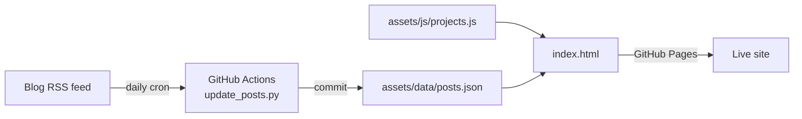

# 🌐 Anish Rane — Personal Portfolio

[](https://anishrane-cox.github.io/Portfolio/)


> Portfolio of a **Generative AI & Machine Learning Engineer** — projects, experience, writing and an **in-browser neural network you can train live**. Zero frameworks, zero build step.

👉 **[Visit the live site](https://anishrane-cox.github.io/Portfolio/)**

---

## ✨ Highlights

- **Neural-network playground** — a small multilayer perceptron written **from scratch in JavaScript** trains in the browser and draws its decision boundary in real time (no ML libraries).
- **Animated network hero** — canvas animation that reacts to the mouse and respects `prefers-reduced-motion`.
- **Project case studies** — filterable project cards with modal deep-dives, driven by one data file.
- **Auto-updating blog feed** — a GitHub Actions workflow runs a standard-library Python script every day, pulls the latest posts from the blog's RSS feed and commits them to `posts.json`.
- **Interactive terminal** section, responsive layout, SEO basics (`sitemap.xml`, `robots.txt`, Open Graph image) and a custom 404 page.

## 🧭 Sections

About · Experience · Projects · Lab (NN playground) · Skills · Writing · Terminal · Contact

## 🏗️ How It Works



## 📁 Structure

```
├── index.html                  # Single-page site
├── 404.html
├── assets/
│   ├── css/style.css           # Design system (responsive, reduced-motion aware)
│   ├── js/projects.js          # ← edit to add / change projects
│   ├── js/network.js           # Animated hero network (canvas)
│   ├── js/playground.js        # In-browser neural network trained from scratch
│   ├── js/main.js              # Nav, filters, case-study modal, blog feed, terminal
│   ├── data/posts.json         # Latest blog posts (auto-refreshed)
│   └── Anish_Rane_Resume.pdf
├── scripts/update_posts.py     # RSS → posts.json (stdlib only, fails safe)
├── .github/workflows/update-posts.yml
├── sitemap.xml · robots.txt · favicon.svg
└── .nojekyll
```

## 🚀 Run Locally

```bash
git clone https://github.com/AnishRane-cox/Portfolio.git
cd Portfolio
python3 -m http.server 8000
# open http://localhost:8000
```

**Deploy:** Settings → Pages → *Deploy from branch* → `main` / root. The `.nojekyll` file stops GitHub from running Jekyll.
